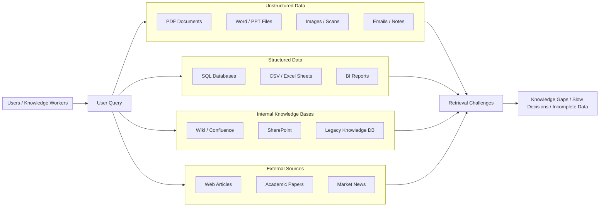

```mermaid
flowchart LR
    subgraph U[Users / Knowledge Workers]
    end

    U --> Q[User Query]

    subgraph S1[Unstructured Data]
        PDF[PDF Documents]
        DOC[Word / PPT Files]
        IMG[Images / Scans]
        MAIL[Emails / Notes]
    end

    subgraph S2[Structured Data]
        SQL[SQL Databases]
        CSV[CSV / Excel Sheets]
        BI[BI Reports]
    end

    subgraph S3[Internal Knowledge Bases]
        WIKI[Wiki / Confluence]
        SP[SharePoint]
        KB[Legacy Knowledge DB]
    end

    subgraph S4[External Sources]
        WEB[Web Articles]
        PAP[Academic Papers]
        NEWS[Market News]
    end

    Q --> S1
    Q --> S2
    Q --> S3
    Q --> S4

    S1 --> P[Retrieval Challenges]
    S2 --> P
    S3 --> P
    S4 --> P

    P --> G[Knowledge Gaps / Slow Decisions / Incomplete Data]
```